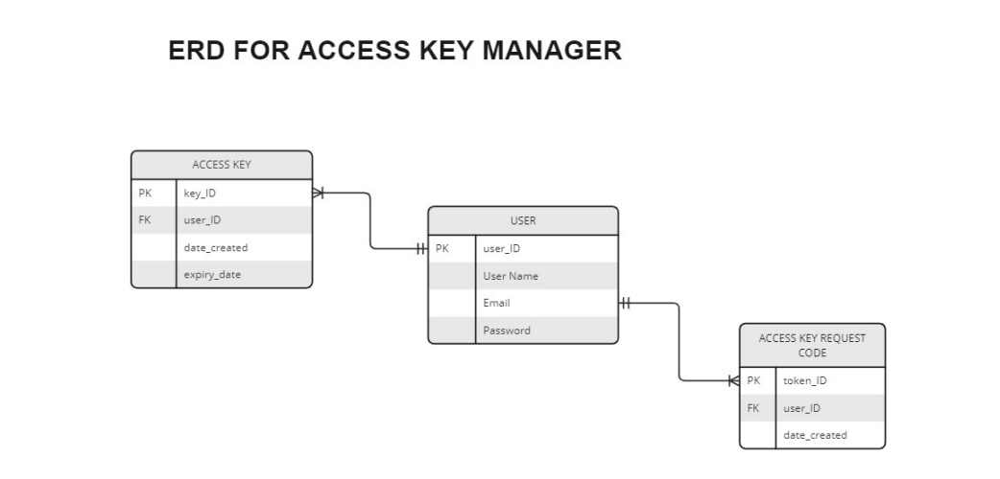

## Access Key Manager

This project aims to develop a web application, Access Key Manager, for Micro-Focus Inc.'s multi-tenant school management platform. Schools can utilize Access Key Manager to purchase and manage access keys, activating their school accounts on the platform.

## **Technologies Used**

- **Programming Language: Python (Django and DRF)**
- **Database: postgresql(for deployment), Sqlite3(for development)**
- **Version: Control: Git**
- **Deployment Platform: render.com**

## **School IT Personnel:**

 **User Management:**

  - Sign up and login with a valid email and password with account verification.
  - Reset password functionality to recover lost credentials.

 **Access Key Management:**

  - View a list of all access keys granted to their school, including active, expired, and revoked keys.
  - See details for each key, including status, procurement date, and expiry date.
  - Request new keys (restricted if an active key already exists).

## **Micro-Focus Admin:**

- Microfocus admin will use the default django admin pannel to manage keys. The mico-focus admin will use the folloing credentials to login into the system.\
  emaild:`apptestmail.ezi.code@gmail.com`\
  password:`microfocus@2024`

 **User Management:**

  - Log in with email and password.
  - Have acces to all users of the system.

 **Access Key Management:**

  - Manually revoke access keys.
  - View all generated keys on the platform, including status, procurement date, and expiry date.

 ## **API Integration:**

  - Access an endpoint `.../api/accounts_details/?email=[user email]` [replace customer email with school email address used to create an accounts on the system without parenthesis] that retrieves active access key details for a provided school email address.

    - Successful response (status code 200) includes details of the active key.
    - No active key found (status code 404).

  - You can access `.../api/schema/` for the api schema

**ERD Diagram for Database Development**
- The below erd diagram contains the fundamental/basic fields that the models should have, in the instance where additional fields are required, can be added.

**Getting Started (for Developers):**

1. Clone the project repository 
2. Install required dependencies using `pip install -r requirements.txt`.
3. Configure database settings in the project's settings file.
4. Run database migrations (`python manage.py migrate`).
5. Create a superuser account for initial setup (`python manage.py createsuperuser`).
6. Start the development server (`python manage.py runserver`).
